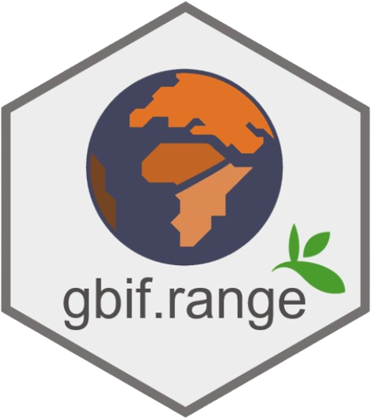

# gbif.range [](https://www.gbif.org)

[](https://github.com/8Ginette8/gbif.range/actions/workflows/R-Package-Auto-Version.yml)
[](https://github.com/8Ginette8/gbif.range/actions/workflows/R-CMD-check-month-test.yml)
[](https://www.repostatus.org/#active)
[](https://doi.org/10.5281/zenodo.20826609)

Species ranges can be estimated from expert maps (for example <a href="https://www.iucnredlist.org/resources/spatial-data-download">IUCN</a> and <a href="https://www.euforgen.org/species/">EUFORGEN</a>) or with modelling approaches. Expert data, however, remain unavailable for many species, whereas modelling workflows often require substantial technical expertise and large numbers of occurrence records. [Global Biodiversity Information Facility (GBIF)](https://www.gbif.org/) — the largest public repository of georeferenced species observations worldwide — offer a practical alternative, yet retrieving them at scale in R remains cumbersome and translating raw occurrences into ecologically meaningful range maps is not straightforward, as records often contain erroneous coordinates that must be identified and removed before spatial analyses.

**gbif.range** provides a complete workflow to retrieve, clean, and analyze GBIF occurrence records and generate ecologically informed species range maps. Built around the GBIF backbone taxonomy, the package handles synonym-aware downloads, dynamic tiling for large datasets, and 13 configurable post-processing filters via `CoordinateCleaner`. Range maps are constrained by bundled or custom ecoregion layers (terrestrial, marine, and freshwater), and can be validated against independent data using built-in evaluation and cross-validation functions. A dedicated disk-based pipeline allows processing very large multi-species GBIF exports without loading them into memory. Additional utilities cover GBIF taxonomy inspection, occurrence thinning, geographic tiling, and GBIF-derived DOI generation.

For full documentation, workflows, and examples, visit the **[package website](https://8ginette8.github.io/gbif.range/)**.

## Installation

```r
# From GitHub (development version)
remotes::install_github("8Ginette8/gbif.range", build_vignettes = TRUE)
library(gbif.range)
```

> **CRAN submission coming soon.** Once available, the package will also be installable with `install.packages("gbif.range")`.

## Quick example

```r
# Download Panthera tigris occurrences
obs.pt <- get_gbif(sp_name = "Panthera tigris")

# Load terrestrial ecoregions and build range map
eco.terra <- read_ecoreg(ecoreg_name = "eco_terra", save_dir = NULL)
range.tiger <- get_range(occ_coord = obs.pt,
                         ecoreg = eco.terra,
                         ecoreg_name = "ECO_NAME",
                         degrees_outlier = 5,
                         clust_pts_outlier = 4)

# Plot
countries <- terra::vect(
  system.file("extdata", "world_countries.shp", package = "gbif.range")
)
terra::plot(countries, col = "#bcbddc")
terra::plot(range.tiger$rangeOutput, col = "#238b45", add = TRUE, axes = FALSE, legend = FALSE)
```

## Citation

Yohann Chauvier, Oskar Hagen, Stefan Pinkert, Camille Albouy, Fabian Fopp, Philipp Brun, Patrice Descombes, Florian Altermatt, Loic Pellissier, Katalin Csilléry. gbif.range: An R package to generate ecologically-informed species range maps from occurrence data with seamless GBIF integration. Authorea. June 30, 2025.
doi: [10.22541/au.175130858.83083354/v1](https://doi.org/10.22541/au.175130858.83083354/v1)
