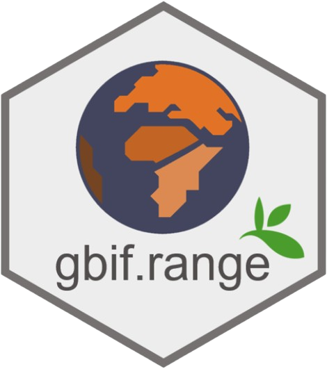

# gbif.range [](https://www.gbif.org)

[](https://github.com/8Ginette8/gbif.range/actions/workflows/R-Package-Auto-Version.yml)
[](https://github.com/8Ginette8/gbif.range/actions/workflows/R-CMD-check-month-test.yml)
[](https://www.repostatus.org/#active)
[](https://doi.org/10.5281/zenodo.20826609)
[](https://CRAN.R-project.org/package=gbif.range)
[](https://CRAN.R-project.org/package=gbif.range)
[](https://CRAN.R-project.org/package=gbif.range)


Mapping species distribution mostly relies on expert ranges (for example, [IUCN](https://www.iucnredlist.org/resources/spatial-data-download) and [EUFORGEN](https://www.euforgen.org/species)) or predictive modeling. However, expert maps remain unavailable for many rare and regional species, while modelling workflows require advanced technical expertise and highly accurate, spatially continuous occurrence data that often demand intensive error-cleaning. The **gbif.range** R package overcomes these limitations by providing a user-friendly, integrated workflow to generate ecologically informed range maps from sparse observations using environmental clustering and convex hulls.

To streamline data acquisition, **gbif.range** handles synonym-aware [Global Biodiversity Information Facility (GBIF)](https://www.gbif.org) downloads and uses dynamic geographic tiling to bypass GBIF's 100,000 record API limit without credentials. The package also automates data curation via 13 custom and configurable `CoordinateCleaner` filters, and constrains estimated ranges using built-in or custom terrestrial, marine, and freshwater ecoregion layers to prevent over-prediction into non-viable habitats. For large-scale workflows, a dedicated disk-based pipeline processes multi-species exports without memory limits, while built-in cross-validation and evaluation functions enable rigorous map validation against independent datasets, offering a robust, low-barrier alternative to traditional modeling approaches.

For full documentation, workflows, and examples, visit the **[package website](https://8ginette8.github.io/gbif.range/)**.

## Installation

```r
# From CRAN
install.packages("gbif.range")

# From GitHub (development version)
remotes::install_github("8Ginette8/gbif.range", build_vignettes = TRUE)

# Load
library(gbif.range)
```

## Quick example

```r
# Download Panthera tigris occurrences
obs.pt <- get_gbif(sp_name = "Panthera tigris")

# Load terrestrial ecoregions and build range map
eco.terra <- read_ecoreg(ecoreg_name = "eco_terra", save_dir = tempdir())
range.tiger <- get_range(occ_coord = obs.pt,
                         ecoreg = eco.terra,
                         ecoreg_name = "ECO_NAME",
                         degrees_outlier = 5,
                         clust_pts_outlier = 4,
                         format = "SpatRaster")

# Plot
countries <- terra::vect(
  system.file("extdata", "world_countries.shp", package = "gbif.range")
)
terra::plot(countries, col = "#bcbddc")
terra::plot(range.tiger$rangeOutput, col = "#238b45", add = TRUE, axes = FALSE, legend = FALSE)
```

## Citation

Yohann Chauvier, Oskar Hagen, Stefan Pinkert, Camille Albouy, Fabian Fopp, Philipp Brun, Patrice Descombes, Florian Altermatt, Loic Pellissier, Katalin Csilléry. gbif.range: An R package to generate ecologically-informed species range maps from occurrence data with seamless GBIF integration. Authorea. June 30, 2025.
doi: [10.22541/au.175130858.83083354/v1](https://doi.org/10.22541/au.175130858.83083354/v1)
