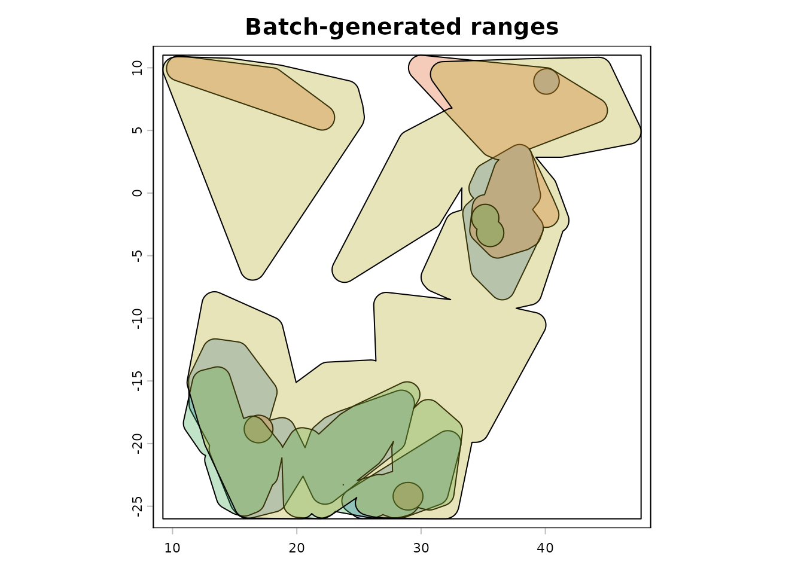

# Part 3: Large Downloaded GBIF Tables

## Scope

This vignette documents the disk-based workflow for large downloaded
GBIF tables. It is intended for situations where occurrences have
already been exported from GBIF and the full table is too large or too
inconvenient to keep in memory.

The workflow is built around three functions:

- [`split_gbif_by_species()`](https://8ginette8.github.io/gbif.range/reference/split_gbif_by_species.md)
  to split a large GBIF table into one file per species or GBIF key,
- [`species_csvs_to_ranges()`](https://8ginette8.github.io/gbif.range/reference/species_csvs_to_ranges.md)
  to read those files sequentially and build one range per species,
- [`read_range_rds()`](https://8ginette8.github.io/gbif.range/reference/read_range_rds.md)
  to read the saved range outputs back from disk.

This workflow is meant for the point where direct credential-free GBIF
retrieval is no longer the most practical option. For many
single-species or moderate-volume tasks,
[`get_gbif()`](https://8ginette8.github.io/gbif.range/reference/get_gbif.md)
is enough. For very large downloaded exports, working from files on disk
is usually the better choice.

## Why the workflow is split into two steps

[`get_range()`](https://8ginette8.github.io/gbif.range/reference/get_range.md)
is intentionally a single-species function. That is scientifically
sensible, because range inference depends on one focal set of
occurrences and one associated taxon concept at a time.

For large multi-species downloads, the package therefore separates file
handling from range inference:

1.  first create one species file per GBIF key,
2.  then process those files one by one.

This design keeps peak memory use low and makes intermediate files easy
to inspect, clean, archive, or parallelize outside R if needed.

It also keeps the biological interpretation clean. Each file still
corresponds to one focal GBIF taxon key, and each range is then inferred
with the same
[`get_range()`](https://8ginette8.github.io/gbif.range/reference/get_range.md)
machinery described in Part 1.

## Example data

The package includes a small GBIF-style offline example under
`inst/extdata`. The file is much smaller than a real GBIF export, but it
exercises the same workflow.

``` r

gbif_file <- ext_file("occ_example_4sps.csv")
utils::head(utils::read.delim(gbif_file, sep = "\t", stringsAsFactors = FALSE))
#>   speciesKey         species                   scientificName decimalLongitude
#> 1    5218781 Crocuta crocuta Crocuta crocuta (Erxleben, 1777)         34.91667
#> 2    5218781 Crocuta crocuta Crocuta crocuta (Erxleben, 1777)         34.91667
#> 3    5218781 Crocuta crocuta Crocuta crocuta (Erxleben, 1777)         34.91667
#> 4    5218781 Crocuta crocuta Crocuta crocuta (Erxleben, 1777)         34.91667
#> 5    5218781 Crocuta crocuta Crocuta crocuta (Erxleben, 1777)         34.91667
#> 6    5218777   Hyaena hyaena   Hyaena hyaena (Linnaeus, 1758)         36.35000
#>   decimalLatitude      basisOfRecord
#> 1        -1.41667 PRESERVED_SPECIMEN
#> 2        -1.41667 PRESERVED_SPECIMEN
#> 3        -1.41667 PRESERVED_SPECIMEN
#> 4        -1.41667 PRESERVED_SPECIMEN
#> 5        -1.41667 PRESERVED_SPECIMEN
#> 6        -1.18333 PRESERVED_SPECIMEN
```

## Step 1: split the downloaded table by species

The first step is to stream the input file in chunks and write one
species file per GBIF key.

``` r

batch_root <- file.path(tempdir(), "gbif-range-batch-vignette")
split_dir <- file.path(batch_root, "split")
occ_dir <- file.path(batch_root, "occ_min")
range_dir <- file.path(batch_root, "ranges")

# Start from a clean temporary workspace so the vignette is reproducible.
unlink(batch_root, recursive = TRUE)

split_summary <- split_gbif_by_species(
  input_file = gbif_file,
  outdir = split_dir,
  chunk_size = 100,
  sep_in = "\t",
  sep_out = "\t",
  overwrite = TRUE,
  verbose = FALSE
)

knitr::kable(
  transform(split_summary,
    species_file = basename(species_file)
  )[, c("species_name", "n_records", "species_file")],
  align = "l"
)
```

|  | species_name | n_records | species_file |
|:---|:---|:---|:---|
| 4 | Crocuta crocuta | 7217 | occurrences_speciesKey_5218781_Crocuta_crocuta.csv |
| 3 | Hyaena brunnea | 495 | occurrences_speciesKey_5218780_Hyaena_brunnea.csv |
| 2 | Hyaena hyaena | 106 | occurrences_speciesKey_5218777_Hyaena_hyaena.csv |
| 1 | Proteles cristata | 281 | occurrences_speciesKey_2433502_Proteles_cristata.csv |

A few implementation details are worth highlighting.

The splitter reads only the requested columns, not the full source
table. It keeps the file extension as `.csv` for convenience, but the
files remain tab-delimited by default. This preserves GBIF-style exports
while still producing species-specific files that are easy to browse or
reuse.

This is also the right place to simplify the table before any
range-building starts. In a production workflow, this step can be used
to retain only the columns needed for the later analysis and to create a
species-level file archive that is easier to inspect than one monolithic
GBIF export.

## Step 2: build ranges sequentially from disk

For this vignette, the ecoregion layer is a single enclosing polygon
built from the extent of the example records. This keeps the example
fully offline and lightweight while still exercising the file-based
range workflow.

In ordinary use, you would typically replace this with
`ecoreg = "eco_terra"` or with a spatial object returned by
`read_ecoreg("eco_terra")`.

``` r

occ_example <- utils::read.delim(gbif_file, sep = "\t", stringsAsFactors = FALSE)

eco_batch <- sf::st_sf(
  data.frame(ECO_NAME = "batch_demo"),
  geometry = sf::st_sfc(
    sf::st_polygon(list(matrix(
      c(
        min(occ_example$decimalLongitude) - 5, min(occ_example$decimalLatitude) - 5,
        max(occ_example$decimalLongitude) + 5, min(occ_example$decimalLatitude) - 5,
        max(occ_example$decimalLongitude) + 5, max(occ_example$decimalLatitude) + 5,
        min(occ_example$decimalLongitude) - 5, max(occ_example$decimalLatitude) + 5,
        min(occ_example$decimalLongitude) - 5, min(occ_example$decimalLatitude) - 5
      ),
      ncol = 2,
      byrow = TRUE
    ))),
    crs = 4326
  )
)

range_summary <- species_csvs_to_ranges(
  species_dir = split_dir,
  ecoreg = eco_batch,
  ecoreg_name = "ECO_NAME",
  outdir = range_dir,
  occ_outdir = occ_dir,
  occ_save_as = "tsv",
  range_save_as = "rds",
  sep_in = "\t",
  overwrite = TRUE,
  degrees_outlier = 30,
  clust_pts_outlier = 2,
  buff_width_point = 1,
  buff_incrmt_pts_line = 0.1,
  buff_width_polygon = 1,
  format = "SpatVector",
  verbose = FALSE
)

knitr::kable(
  transform(range_summary,
    occ_file   = sub(".*speciesKey_", "", basename(occ_file)),
    range_file = sub(".*speciesKey_", "", basename(range_file))
  )[, c("species_name", "n_points", "occ_file", "range_file")],
  align = "l"
)
```

| species_name | n_points | occ_file | range_file |
|:---|:---|:---|:---|
| Proteles cristatus septentrionalis Rothschild, 1902 | 232 | 2433502_Proteles_cristatus_septentrionalis_Rothschild_1902.tsv | 2433502_Proteles_cristatus_septentrionalis_Rothschild_1902.rds |
| Hyaena hyaena (Linnaeus, 1758) | 98 | 5218777_Hyaena_hyaena_Linnaeus_1758.tsv | 5218777_Hyaena_hyaena_Linnaeus_1758.rds |
| Parahyaena brunnea (Thunberg, 1820) | 413 | 5218780_Parahyaena_brunnea_Thunberg_1820.tsv | 5218780_Parahyaena_brunnea_Thunberg_1820.rds |
| Crocuta crocuta fisi Heller, 1914 | 5828 | 5218781_Crocuta_crocuta_fisi_Heller_1914.tsv | 5218781_Crocuta_crocuta_fisi_Heller_1914.rds |

Internally,
[`species_csvs_to_ranges()`](https://8ginette8.github.io/gbif.range/reference/species_csvs_to_ranges.md)
reduces each species file to the minimal structure expected by
[`get_range()`](https://8ginette8.github.io/gbif.range/reference/get_range.md):
one focal species plus decimal longitude and latitude. It can also save
those minimal occurrence tables to disk, which is useful if you want to
inspect exactly what was passed to
[`get_range()`](https://8ginette8.github.io/gbif.range/reference/get_range.md)
after deduplication.

Once the occurrences are split to species level, it becomes
straightforward to rerun the exact same batch with different ecoregions,
different range arguments, or stricter deduplication while keeping the
raw downloaded export unchanged.

## The built-in ecoregion shortcut

The same workflow can resolve packaged ecoregions internally:

``` r

range_summary <- species_csvs_to_ranges(
  species_dir = split_dir,
  ecoreg = "eco_terra",
  ecoreg_name = "ECO_NAME",
  outdir = range_dir,
  overwrite = TRUE
)
```

This is the most convenient option when your downloaded table and your
intended range product both target a broad terrestrial workflow.

It is also the most natural way to move from a large terrestrial GBIF
export to a batch of ecoregion-constrained range maps without having to
pre-load the ecoregion object yourself.

## A production-style terrestrial batch

The offline vignette uses a simple polygon because it must build quickly
and without network access. A real downloaded terrestrial workflow would
normally look more like this:

``` r

#split_summary <- split_gbif_by_species(
#  input_file = "gbif_download.tsv",
#  outdir = "species_occurrences",
#  chunk_size = 1e5,
#  sep_in = "\t",
#  sep_out = "\t",
#  overwrite = TRUE
#)

#range_summary <- species_csvs_to_ranges(
#  species_dir = "species_occurrences",
#  ecoreg = "eco_terra",
#  ecoreg_name = "ECO_NAME",
#  outdir = "species_ranges",
#  occ_outdir = "species_occurrences_min",
#  occ_save_as = "tsv",
#  range_save_as = "rds",
#  overwrite = TRUE
#)
```

This is the clearest batch version of the main terrestrial workflow: one
GBIF export in, one species file per taxon, one saved range per taxon.

## Inspect one species file before building ranges

One advantage of the split-first design is that you can inspect or clean
individual species files before generating ranges. This is often useful
when testing a new workflow on a few taxa before launching a full batch.

``` r

first_species_file <- split_summary$species_file[1]
utils::head(utils::read.delim(first_species_file, sep = "\t", stringsAsFactors = FALSE))
#>   speciesKey         species                   scientificName decimalLongitude
#> 1    5218781 Crocuta crocuta Crocuta crocuta (Erxleben, 1777)         34.91667
#> 2    5218781 Crocuta crocuta Crocuta crocuta (Erxleben, 1777)         34.91667
#> 3    5218781 Crocuta crocuta Crocuta crocuta (Erxleben, 1777)         34.91667
#> 4    5218781 Crocuta crocuta Crocuta crocuta (Erxleben, 1777)         34.91667
#> 5    5218781 Crocuta crocuta Crocuta crocuta (Erxleben, 1777)         34.91667
#> 6    5218781 Crocuta crocuta Crocuta crocuta (Erxleben, 1777)         34.91667
#>   decimalLatitude
#> 1        -1.41667
#> 2        -1.41667
#> 3        -1.41667
#> 4        -1.41667
#> 5        -1.41667
#> 6        -1.41667
```

That inspection step is simple, but it is often the moment where issues
such as missing coordinates, duplicated points, or unexpected names
become obvious.

## Step 3: read and inspect the saved ranges

If the range outputs are saved as `.rds`,
[`read_range_rds()`](https://8ginette8.github.io/gbif.range/reference/read_range_rds.md)
restores them to a simple list with `init.args` and `rangeOutput`.

``` r

# Read the first saved range to inspect its structure.
first_range <- read_range_rds(range_summary$range_file[1])
names(first_range)
#> [1] "init.args"   "rangeOutput"
class(first_range$rangeOutput)
#> [1] "SpatVector"
#> attr(,"package")
#> [1] "terra"
```

The example below overlays every saved range in the batch summary. This
is a useful diagnostic pattern when checking whether a batch run
produced geometries with the expected extent and shape.

``` r

range_colors <- c(
  rgb(0.10, 0.40, 0.75, 0.30),
  rgb(0.85, 0.35, 0.10, 0.30),
  rgb(0.20, 0.65, 0.30, 0.30),
  rgb(0.70, 0.65, 0.10, 0.30)
)

combined_ext <- terra::ext(first_range$rangeOutput)

if (nrow(range_summary) > 1) {
  for (i in 2:nrow(range_summary)) {
    range_i <- read_range_rds(range_summary$range_file[i])
    combined_ext <- terra::ext(
      min(terra::xmin(combined_ext), terra::xmin(range_i$rangeOutput)),
      max(terra::xmax(combined_ext), terra::xmax(range_i$rangeOutput)),
      min(terra::ymin(combined_ext), terra::ymin(range_i$rangeOutput)),
      max(terra::ymax(combined_ext), terra::ymax(range_i$rangeOutput))
    )
  }
}

terra::plot(combined_ext, col = NA, legend = FALSE, main = "Batch-generated ranges")
terra::plot(first_range$rangeOutput, add = TRUE, col = range_colors[1])

if (nrow(range_summary) > 1) {
  for (i in 2:nrow(range_summary)) {
    range_i <- read_range_rds(range_summary$range_file[i])
    terra::plot(range_i$rangeOutput, add = TRUE, col = range_colors[i])
  }
}
```



## Practical advice

The disk-based workflow is most useful in three situations.

First, when a direct in-memory call to
[`get_gbif()`](https://8ginette8.github.io/gbif.range/reference/get_gbif.md)
is not appropriate because the project already relies on downloaded GBIF
exports.

Second, when a large multi-species table needs to be checked, cleaned,
or archived at the species level before range inference.

Third, when the same species-specific occurrence files need to be
processed repeatedly with different
[`get_range()`](https://8ginette8.github.io/gbif.range/reference/get_range.md)
settings, ecoregions, or evaluation schemes.

The third point matters scientifically, not just computationally. It
makes parameter sensitivity analyses much cleaner, because you can rerun
the same archived species files under alternative ecoregion layers or
buffering choices without changing the underlying occurrence input.

## Take-home message

The disk-based workflow turns `gbif.range` into a practical bridge
between very large GBIF exports and species-level range inference.
Instead of treating file splitting and range building as an external
preprocessing step, Gbif.range provides a coherent, testable, and
documented path from a downloaded GBIF table to saved species ranges on
disk.
