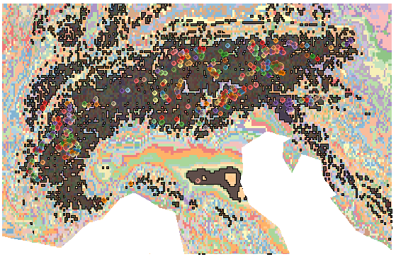
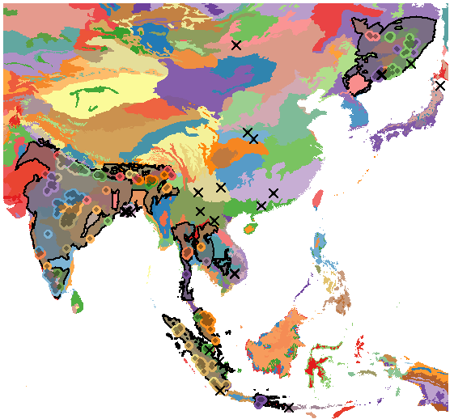
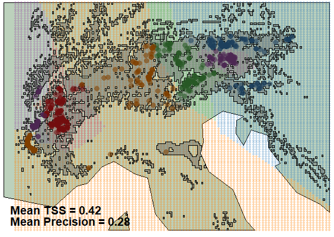
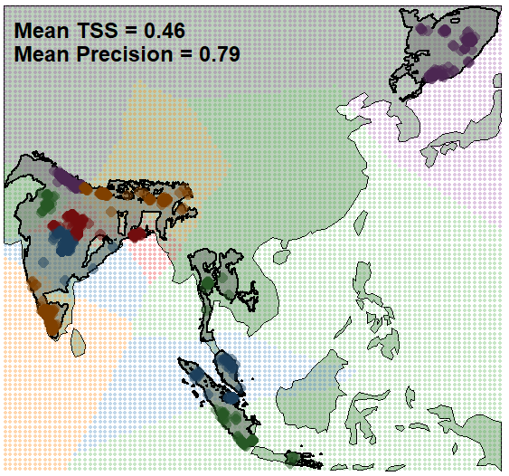
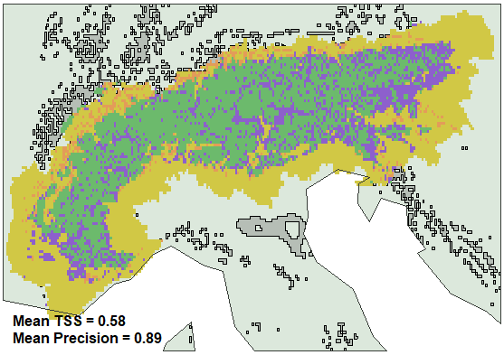
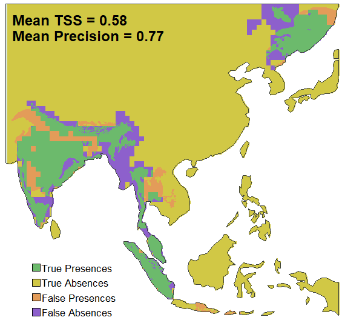
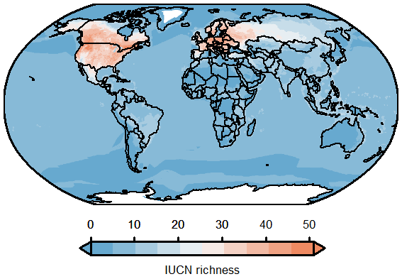
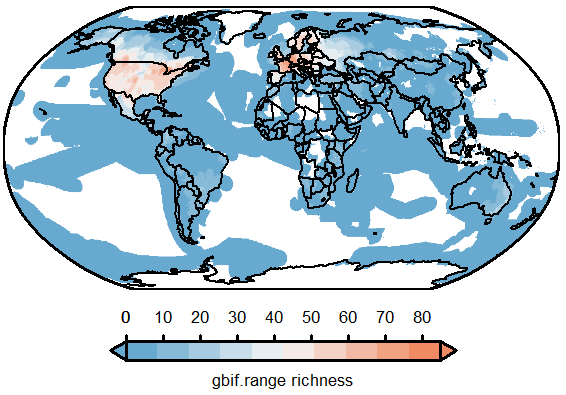
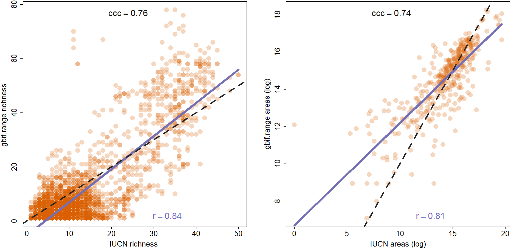

# Supplementary: gbif.range manuscript's figures

## Scope

This vignette provides the exact code used to reproduce the figures in
Chauvier-Mendes et al. (2025), currently under review, included for
transparency and to let readers and reviewers verify how each figure was
generated from the functions of this package. All chunks are set to
`eval = FALSE`; run them locally to regenerate the figures from GBIF and
the bundled example data — the figures shown below are cached, static
images.

Note that basemaps here use a low-resolution world map bundled with the
package, rather than the `rnaturalearth::ne_countries(scale = 10)` HD
dataset used in the manuscript, so coastline detail and ecoregion colors
will differ slightly from the published version.

The citation below refers to the current preprint and will be updated
once the associated manuscript is published.

> Chauvier-Mendes, Y., Hagen, O., Pinkert, S., Albouy, C., Fopp, F.,
> Brun, P., Descombes, P., Altermatt, F., Pellissier, L., & Csilléry, K.
> (2025). *gbif.range: An R package to generate ecologically-informed
> species range maps from occurrence data with seamless GBIF
> integration*. Authorea preprint.

## Online data retrieval

The figures below share a common set of GBIF downloads and ecoregion
layers. To avoid repeating the same network calls in every section, all
data used across the figures is retrieved once here. Run this section
first if executing chunks individually rather than the whole vignette in
order.

``` r

# Study extent, world boundaries, and packaged terrestrial ecoregions
shp.lonlat <- terra::vect(
  paste0(
    system.file(package = "gbif.range"),
    "/extdata/shp_lonlat.shp"
  )
)
countries <- terra::vect(
  system.file(
    "extdata", "world_countries.shp",
    package = "gbif.range"
  )
)
eco.terra <- read_ecoreg(
  ecoreg_name = "eco_terra", save_dir = tempdir()
)

# Custom, high-resolution ecoregions for the Alps study extent
# ('rst' --> 5x5-km resolution)
rst.path <- paste0(
  system.file(package = "gbif.range"),
  "/extdata/rst.tif"
)
rst <- terra::rast(rst.path)
my.eco <- make_ecoreg(env = rst, nclass = 200, format = "SpatVector")

# Continent extent to keep only terrestrial my.eco
contExtL.shp <- terra::aggregate(
  terra::crop(countries, terra::ext(rst))
)
contExtS.shp <- terra::crop(
  contExtL.shp,
  terra::ext(shp.lonlat)
)
my.ecoS <- intersect(my.eco, contExtS.shp)

# GBIF occurrences for the two focal species used throughout
obs.arcto <- get_gbif(
  sp_name = "Arctostaphylos alpinus",
  geo = shp.lonlat,
  grain = 1
)
obs.pt <- get_gbif(sp_name = "Panthera tigris")

# Diversity rasters used in Figure 3
iucn.robin <- terra::rast(
  paste0(
    system.file(package = "gbif.range"),
    "/extdata/iucn_div_robin.tif"
  )
)
gf.robin <- terra::rast(
  paste0(
    system.file(package = "gbif.range"),
    "/extdata/gf_div_robin.tif"
  )
)
```

## Figure 1a (left) — Custom ecoregion range: *Arctostaphylos alpinus*

This figure demonstrates a fully custom, high-resolution workflow:
ecoregions are derived from CHELSA bioclimatic layers (Karger et
al. 2017) via
[`make_ecoreg()`](https://8ginette8.github.io/gbif.range/reference/make_ecoreg.md),
and the species’ range is constrained to a small alpine extent.

``` r

# Regional range at ~5x5-km resoluiton ('my.eco' resolution)
range.arcto <- get_range(
  occ_coord = obs.arcto,
  ecoreg = my.eco,
  ecoreg_name = "EcoRegion",
  res = 0.05
)

# Assign colors to ecoregions
range.arctoS <- terra::crop(range.arcto$rangeOutput, contExtS.shp)
col.palette <- grDevices::colorRampPalette(c(
  "#a6cee3", "#1f78b4", "#b2df8a", "#33a02c",
  "#fb9a99", "#e31a1c", "#fdbf6f", "#ff7f00",
  "#cab2d6", "#6a3d9a", "#ffff99", "#b15928"
))
colcol <- col.palette(length(my.ecoS))
set.seed(7)
my.ecoS$color <- sample(
  paste0(colcol, ""),
  length(my.ecoS),
  replace = FALSE
)

pt.col <- terra::extract(
  x = my.ecoS,
  y = as.data.frame(
    obs.arcto[, c(
      "decimalLongitude", "decimalLatitude"
    )]
  )
)
pt.plot <- obs.arcto[
  !is.na(pt.col$color),
  c("decimalLongitude", "decimalLatitude")
]
pt.col2 <- pt.col[!is.na(pt.col$color), "color"]
pt.col3 <- grDevices::adjustcolor(
  pt.col2, red.f = 0.6, green.f = 0.6,
  blue.f = 0.6
)

# Plot
terra::plot(
  my.ecoS,
  col = paste0(my.ecoS$color, "99"),
  border = NA,
  axes = FALSE
)
terra::plot(
  terra::as.polygons(range.arctoS),
  border = "black",
  lwd = 1,
  col = "#00000099",
  add = TRUE
)
graphics::points(
  pt.plot, col = pt.col2, pch = 16, cex = 1
)
graphics::points(
  pt.plot, col = pt.col3, pch = 16, cex = 0.6
)
```



## Figure 1a (right) — Packaged ecoregion range: *Panthera tigris*

This figure demonstrates the complementary broad-scale workflow: a
worldwide range built directly from the packaged terrestrial ecoregions
(Olson et al. 2001; The Nature Conservancy 2009) via
[`read_ecoreg()`](https://8ginette8.github.io/gbif.range/reference/read_ecoreg.md),
requiring no custom ecoregion layer.

``` r

# Global range at default ~10x10-km resolution
range.tiger <- get_range(
  occ_coord = obs.pt,
  ecoreg = eco.terra,
  ecoreg_name = "ECO_NAME"
)

# Assign colors to ecoregions
ext.tiger.eco <- terra::ext(range.tiger$rangeOutput)
ext.tiger.eco  <- c(
  ext.tiger.eco[1] - 2, ext.tiger.eco[2] + 2,
  ext.tiger.eco[3] - 2, ext.tiger.eco[4] + 2
)
eco.local <- terra::crop(eco.terra, ext.tiger.eco)
col.palette <- grDevices::colorRampPalette(c(
  "#a6cee3", "#1f78b4", "#b2df8a", "#33a02c",
  "#fb9a99", "#e31a1c", "#fdbf6f", "#ff7f00",
  "#cab2d6", "#6a3d9a", "#ffff99", "#b15928"
))
colcol <- col.palette(length(eco.local))
set.seed(3)
eco.local$color <- sample(
  paste0(colcol, ""),
  length(eco.local),
  replace = FALSE
)
pt.coords <- as.data.frame(
  obs.pt[, c("decimalLongitude", "decimalLatitude")]
)
pt.col <- terra::extract(eco.local, pt.coords)
pt.plot <- obs.pt[
  !is.na(pt.col$color),
  c("decimalLongitude", "decimalLatitude")
]
pt.col2 <- pt.col[!is.na(pt.col$color), "color"]
pt.col3 <- grDevices::adjustcolor(
  pt.col2, red.f = 0.6, green.f = 0.6,
  blue.f = 0.6
)
out.plot <- terra::extract(range.tiger$rangeOutput, pt.coords)
op.na <- is.na(out.plot[, 2])
out.plot <- obs.pt[
  op.na, c("decimalLongitude", "decimalLatitude")
]

# Plot
terra::plot(
  eco.local,
  col = eco.local$color,
  border = NA,
  axes = FALSE
)
terra::plot(
  terra::as.polygons(range.tiger$rangeOutput),
  border = "black",
  lwd = 2,
  col = "#63636399",
  add = TRUE
)
graphics::points(
  pt.plot, col = pt.col2, pch = 16, cex = 1.5
)
graphics::points(
  pt.plot, col = pt.col3, pch = 16, cex = 0.8
)
graphics::points(
  out.plot, col = "black", pch = 4, cex = 1.5,
  lwd = 2
)
```



## Figure 2a–b — Cross-validation of ecoregion-constrained ranges

This figure evaluates both ranges from Figure 1 using
[`cv_range()`](https://8ginette8.github.io/gbif.range/reference/cv_range.md)’s
block cross-validation, reporting mean sensitivity and precision against
held-out occurrence folds for the custom-ecoregion (*A. alpinus*) and
packaged-ecoregion (*P. tigris*) workflows.

``` r

# ------------------------------------------
# Arctostaphylos alpinus (custom ecoregion)
# ------------------------------------------

# Create pseudo-absences
  # First remove observations considered outliers in get_range()
xy.df <- range.arcto$init.args$occ_coord
r.ext <- terra::ext(range.arcto$rangeOutput)
Xrm.cond <- xy.df$decimalLongitude >= r.ext[1] &
  xy.df$decimalLongitude <= r.ext[2]
Yrm.cond <- xy.df$decimalLatitude >= r.ext[3] &
  xy.df$decimalLatitude <= r.ext[4]
xy.df <- xy.df[Xrm.cond & Yrm.cond, ]
  # Sample n regular background points over the range extent
x.interv <- (r.ext[2] - r.ext[1]) / (sqrt(1e4) - 1)
y.interv <- (r.ext[4] - r.ext[3]) / (sqrt(1e4) - 1)
lx <- seq(r.ext[1], r.ext[2], x.interv)
ly <- seq(r.ext[3], r.ext[4], y.interv)
bp.xy <- expand.grid(
  decimalLongitude = lx,
  decimalLatitude = ly
)

# Combine observations with background
obs.xy <- xy.df[, c("decimalLongitude", "decimalLatitude")]
all.xy <- rbind(obs.xy, bp.xy)
all.xy$Pres <- 0
all.xy[1:nrow(obs.xy), "Pres"] <- 1

# Run block-cv
xy.pres <- all.xy$Pres
cv.strat <- make_blocks(
  nfolds = 5,
  df = all.xy[, c("decimalLongitude", "decimalLatitude")],
  nblocks = 5 * 2,
  pres = xy.pres
)
all.xy$bcv <- cv.strat
all.xy[all.xy$bcv %in% 1, "col"] <- "#e41a1c"
all.xy[all.xy$bcv %in% 2, "col"] <- "#377eb8"
all.xy[all.xy$bcv %in% 3, "col"] <- "#4daf4a"
all.xy[all.xy$bcv %in% 4, "col"] <- "#984ea3"
all.xy[all.xy$bcv %in% 5, "col"] <- "#ff7f00"
all.xy[all.xy$Pres %in% 1, "col"] <- substr(
  grDevices::adjustcolor(
    all.xy[all.xy$Pres %in% 1, "col"],
    red.f = 0.5, green.f = 0.5, blue.f = 0.5
  ),
  1, 7
)

# Evaluate
ar.test <- cv_range(
  range_object = range.arcto,
  cv = "block-cv",
  nfolds = 5,
  nblocks = 2
)

# Use the broader (L) extent and country borders so
# the evaluation text fits on the plot
ext.L <- terra::ext(contExtL.shp)
world.local.ar <- terra::crop(countries, ext.L)
world.local.ar <- terra::aggregate(world.local.ar)
pres <- all.xy[all.xy$Pres %in% 1, ]
abs.pts <- all.xy[all.xy$Pres %in% 0, ]
pres_coords <- as.data.frame(
  pres[, c("decimalLongitude", "decimalLatitude")]
)
id.in <- terra::extract(
  range.arcto$rangeOutput, pres_coords
)
pres <- pres[!is.na(id.in[, 2]), ]

# Plot
terra::plot(
  world.local.ar, col = "#bcd1bc",
  axes = FALSE, lwd = 1
)
graphics::points(
  abs.pts, col = paste0(abs.pts$col, "50"),
  pch = 16, cex = 0.5
)
terra::plot(
  terra::as.polygons(range.arcto$rangeOutput),
  border = "black", lwd = 1.7,
  col = "#63636370", add = TRUE
)
graphics::points(
  pres, col = paste0(pres$col, "90"),
  pch = 16, cex = 1.3
)

# Evaluation text anchored to the L extent's bottom-left corner
txt.x <- ext.L[1] + 0.02 * (ext.L[2] - ext.L[1])
txt.y1 <- ext.L[3] + 0.09 * (ext.L[4] - ext.L[3])
txt.y2 <- ext.L[3] + 0.04 * (ext.L[4] - ext.L[3])

graphics::text(
  txt.x, txt.y1,
  paste(
    "Mean TSS =",
    round(tail(ar.test[, "TSS"], 1), 2)
  ),
  cex = 1.2, font = 2, adj = 0
)
graphics::text(
  txt.x, txt.y2,
  paste(
    "Mean Precision =",
    round(tail(ar.test[, "Precision"], 1), 2)
  ),
  cex = 1.2, font = 2, adj = 0
)
```



The tiger panel follows the same block cross-validation, applied instead
to the packaged-ecoregion, worldwide range.

``` r

# ------------------------------------------
# Panthera tigris (packaged ecoregion)
# ------------------------------------------

ext.temp.t2 <- terra::ext(range.tiger$rangeOutput)
ext.temp.t2  <- c(
  ext.temp.t2[1] - 0.2, ext.temp.t2[2] + 0.2,
  ext.temp.t2[3] - 0.2, ext.temp.t2[4] + 0.2
)

# Create pseudo-absences
  # First remove observations considered outliers in get_range()
xy.df <- range.tiger$init.args$occ_coord
r.ext <- terra::ext(range.tiger$rangeOutput)
Xrm.cond <- xy.df$decimalLongitude >= r.ext[1] &
  xy.df$decimalLongitude <= r.ext[2]
Yrm.cond <- xy.df$decimalLatitude >= r.ext[3] &
  xy.df$decimalLatitude <= r.ext[4]
xy.df <- xy.df[Xrm.cond & Yrm.cond, ]
  # Sample n regular background points over the range extent
x.interv <- (r.ext[2] - r.ext[1]) / (sqrt(1e4) - 1)
y.interv <- (r.ext[4] - r.ext[3]) / (sqrt(1e4) - 1)
lx <- seq(r.ext[1], r.ext[2], x.interv)
ly <- seq(r.ext[3], r.ext[4], y.interv)
bp.xy <- expand.grid(
  decimalLongitude = lx,
  decimalLatitude = ly
)

# Combine observations with background
obs.xy <- xy.df[, c("decimalLongitude", "decimalLatitude")]
all.xy <- rbind(obs.xy, bp.xy)
all.xy$Pres <- 0
all.xy[1:nrow(obs.xy), "Pres"] <- 1

# Run block-cv
xy.pres <- all.xy$Pres
cv.strat <- make_blocks(
  nfolds = 5,
  df = all.xy[, c("decimalLongitude", "decimalLatitude")],
  nblocks = 5 * 2,
  pres = xy.pres
)
all.xy$bcv <- cv.strat
all.xy[all.xy$bcv %in% 1, "col"] <- "#e41a1c"
all.xy[all.xy$bcv %in% 2, "col"] <- "#377eb8"
all.xy[all.xy$bcv %in% 3, "col"] <- "#4daf4a"
all.xy[all.xy$bcv %in% 4, "col"] <- "#984ea3"
all.xy[all.xy$bcv %in% 5, "col"] <- "#ff7f00"
all.xy[all.xy$Pres %in% 1, "col"] <- substr(
  grDevices::adjustcolor(
    all.xy[all.xy$Pres %in% 1, "col"],
    red.f = 0.5, green.f = 0.5, blue.f = 0.5
  ),
  1, 7
)

# Evaluate
pt.test <- cv_range(
  range_object = range.tiger,
  cv = "block-cv",
  nfolds = 5,
  nblocks = 2
)

# Use extent and country borders
world.local.ti <- terra::crop(countries, ext.temp.t2)
world.local.ti <- terra::aggregate(world.local.ti)
pres <- all.xy[all.xy$Pres %in% 1, ]
abs.pts <- all.xy[all.xy$Pres %in% 0, ]
pres_coords <- as.data.frame(
  pres[, c("decimalLongitude", "decimalLatitude")]
)
id.in <- terra::extract(range.tiger$rangeOutput, pres_coords)
pres <- pres[!is.na(id.in[, 2]), ]

# Plot
terra::plot(
  world.local.ti, col = "#bcd1bc",
  axes = FALSE, lwd = 1
)
graphics::points(
  abs.pts, col = paste0(abs.pts$col, "50"),
  pch = 16, cex = 0.6
)
terra::plot(
  terra::as.polygons(range.tiger$rangeOutput),
  border = "black", lwd = 2,
  col = "#63636370", add = TRUE
)
graphics::points(
  pres, col = paste0(pres$col, "80"),
  pch = 16, cex = 1.6
)

# Evaluation text anchored to the tiger extent's top-left corner
txt.x.t <- ext.temp.t2[1] + 0.02 * (ext.temp.t2[2] - ext.temp.t2[1])
txt.y1.t <- ext.temp.t2[4] - 0.05 * (ext.temp.t2[4] - ext.temp.t2[3])
txt.y2.t <- ext.temp.t2[4] - 0.10 * (ext.temp.t2[4] - ext.temp.t2[3])

graphics::text(
  txt.x.t, txt.y1.t,
  paste(
    "Mean TSS =",
    round(tail(pt.test[, "TSS"], 1), 2)
  ),
  cex = 1.5, font = 2, adj = 0
)
graphics::text(
  txt.x.t, txt.y2.t,
  paste(
    "Mean Precision =",
    round(tail(pt.test[, "Precision"], 1), 2)
  ),
  cex = 1.5, font = 2, adj = 0
)
```



## Figure 2c–d — Evaluation against external validation data

This figure evaluates the ranges from Figure 1a (`range.arcto`,
`range.tiger`) against independent species distribution model outputs
bundled with the package, using
[`evaluate_range()`](https://8ginette8.github.io/gbif.range/reference/evaluate_range.md)
to report precision and sensitivity relative to external validation data
rather than held-out occurrences.

``` r

# -------------------------------------
# Arctostaphylos alpinus (custom ecoregion)
# -------------------------------------

root.dir <- list.files(
  system.file(package = "gbif.range"),
  pattern = "extdata",
  full.names = TRUE
)

res5km <- evaluate_range(
  root_dir = root.dir,
  valData_dir = "SDM",
  ecoRM_dir = "EcoRM",
  verbose = TRUE,
  print_map = FALSE,
  valData_type = "TIFF",
  mask = NULL,
  res_fact = NULL
)

# Plot plant
terra::plot(
  contExtL.shp, col = "#dce8dc",
  axes = FALSE, lwd = 1
)
terra::plot(
  terra::as.polygons(range.arcto$rangeOutput),
  lwd = 0.1, col = "#63636350", add = TRUE
)
terra::plot(
  res5km$overlay_list[[1]],
  col = c(
    "#d1c845", "#e39c59", "#8d60cc", "#6cba6c"
  ),
  breaks = c(-0.5, 0.5, 1.5, 2.5, 3.5),
  axes = FALSE, legend = FALSE,
  las = 1, add = TRUE
)

# Evaluation text anchored to the L extent's bottom-left corner
ext.L <- terra::ext(contExtL.shp)
txt.x <- ext.L[1] + 0.02 * (ext.L[2] - ext.L[1])
txt.y1 <- ext.L[3] + 0.09 * (ext.L[4] - ext.L[3])
txt.y2 <- ext.L[3] + 0.04 * (ext.L[4] - ext.L[3])

graphics::text(
  txt.x, txt.y1,
  paste(
    "Mean TSS =",
    round(res5km$df_eval[1, "TSS_ecoRM"], 2)
  ),
  cex = 1, font = 2, adj = 0
)
graphics::text(
  txt.x, txt.y2,
  paste(
    "Mean Precision =",
    round(res5km$df_eval[1, "Prec_ecoRM"], 2)
  ),
  cex = 1, font = 2, adj = 0
)
terra::plot(
  contExtL.shp,
  border = "#383d38", axes = FALSE,
  lwd = 1, add = TRUE
)
```



The tiger panel follows the same external-validation evaluation, applied
instead to the packaged-ecoregion, worldwide range.

``` r

# -------------------------------------
# Panthera tigris (packaged ecoregion)
# -------------------------------------

# Plot tiger
terra::plot(
  world.local.ti, col = "#dce8dc",
  axes = FALSE, lwd = 1
)
toPlot <- terra::mask(
  res5km$overlay_list[[6]], world.local.ti
)
terra::plot(
  toPlot,
  col = c(
    "#d1c845", "#e39c59", "#8d60cc", "#6cba6c"
  ),
  breaks = c(-0.5, 0.5, 1.5, 2.5, 3.5),
  axes = FALSE, legend = FALSE,
  las = 1, add = TRUE
)

# Evaluation text anchored to the tiger extent's top-left corner
txt.x.t <- ext.temp.t2[1] + 0.02 * (ext.temp.t2[2] - ext.temp.t2[1])
txt.y1.t <- ext.temp.t2[4] - 0.05 * (ext.temp.t2[4] - ext.temp.t2[3])
txt.y2.t <- ext.temp.t2[4] - 0.10 * (ext.temp.t2[4] - ext.temp.t2[3])

graphics::text(
  txt.x.t, txt.y1.t,
  paste(
    "Mean TSS =",
    round(res5km$df_eval[6, "TSS_ecoRM"], 2)
  ),
  cex = 1.5, font = 2, adj = 0
)
graphics::text(
  txt.x.t, txt.y2.t,
  paste(
    "Mean Precision =",
    round(res5km$df_eval[6, "Prec_ecoRM"], 2)
  ),
  cex = 1.5, font = 2, adj = 0
)
terra::plot(
  world.local.ti,
  border = "#383d38", axes = FALSE,
  lwd = 1, add = TRUE
)
leg.x <- ext.temp.t2[1] + 0.05 * (ext.temp.t2[2] - ext.temp.t2[1])
leg.y <- ext.temp.t2[3] + 0.20 * (ext.temp.t2[4] - ext.temp.t2[3])
graphics::legend(
  leg.x, leg.y,
  legend = c(
    "True Presences", "True Absences",
    "False Presences", "False Absences"
  ),
  fill = c(
    "#6cba6c", "#d1c845", "#e39c59", "#8d60cc"
  ),
  bg = NA, box.col = NA,
  cex = 1.1,
  x.intersp = 0.2
)
```



## Figure 3 — Global richness comparison and correlation

This figure compares species richness estimated from
`gbif.range`-derived ranges against IUCN expert range maps (IUCN 2024),
at the global scale. `iucn.robin` and `gf.robin` were loaded in “Online
data retrieval” above.

``` r

# -------------------------------------
# World maps: IUCN vs gbif.range richness
# -------------------------------------

# CRS
robin <- paste(
  "+proj=robin +lon_0=0 +x_0=0 +y_0=0",
  "+datum=WGS84 +units=m +no_defs +type=crs"
)

# Reproject countries
countries.robin <- terra::project(countries, robin)

# Boundary box
bb <- terra::as.polygons(
  terra::ext(-180, 180, -90, 90),
  crs = "EPSG:4326"
)
bb <- terra::densify(bb, interval = 1)
bb.robin <- terra::project(bb, robin)

# Shared diverging color palette for both maps
col <- grDevices::colorRampPalette(
  c("#67a9cf", "#f7f7f7", "#ef8a62")
)

# Plot IUCN map
max.iucn <- round(terra::minmax(iucn.robin)[2])
terra::plot(
  iucn.robin,
  axes = FALSE, legend = FALSE,
  col = col(10), smooth = TRUE,
  mar = c(1, 1, 1, 5)
)
terra::plot(countries.robin, add = TRUE, lwd = 2)
terra::plot(bb.robin, add = TRUE, lwd = 3)
oldpar <- graphics::par(xpd = NA, lwd = 3)
cscl(
  colors = col(10),
  crds = c(-9501111, 9734033, -11800000, -13000000),
  zrng = c(0, max.iucn),
  tickle = -0.3, cx = 1.1, lablag = -1.3,
  tria = "b", at = seq(0, max.iucn, 10),
  horiz = TRUE, title = "IUCN richness",
  labs = seq(0, max.iucn, 10), titlag = 2
)
graphics::par(oldpar)

# Plot GBIF.RANGE map
max.gf <- round(terra::minmax(gf.robin)[2])
terra::plot(
  gf.robin,
  axes = FALSE, legend = FALSE,
  col = col(10), smooth = TRUE,
  mar = c(1, 1, 1, 5)
)
terra::plot(countries.robin, add = TRUE, lwd = 2)
terra::plot(bb.robin, add = TRUE, lwd = 3)
oldpar <- graphics::par(xpd = NA, lwd = 3)
cscl(
  colors = col(10),
  crds = c(-9501111, 9734033, -11800000, -13000000),
  zrng = c(0, max.gf),
  tickle = -0.3, cx = 1.1, lablag = -1.3,
  tria = "b", at = seq(0, max.gf, 10),
  horiz = TRUE, title = "gbif.range richness",
  labs = seq(0, max.gf, 10), titlag = 2
)
graphics::par(oldpar)
```



The scatter plots below summarize richness and range-area agreement
between the two products, reporting Lin’s concordance correlation
coefficient and Pearson’s r for each.

``` r

# -------------------------------------
# Scatter plots: richness and area agreement
# -------------------------------------

# Load area table
data(area_data)

# Extract data to plot
cor.ras <- terra::rast(list(gf.robin, iucn.robin))
names(cor.ras) <- c("RANGE", "IUCN")
set.seed(1)
samp.div <- terra::spatSample(
  cor.ras, 5000, replace = FALSE, na.rm = TRUE
)
dat.plot <- list(samp.div, area_data[, -1])
strings <- c("richness", "areas")

# Plot diversities relationship, side by side
oldpar <- graphics::par(mfrow = c(1, 2), mar = c(5, 5.5, 4, 2))
lapply(seq_along(dat.plot), function(x) {

  # Extract the data
  xy <- dat.plot[[x]]
  sex <- 2.5
  col <- "#d95f0240"
  add <- ""

  # Log or not depending on the output
  if (strings[x] == "areas") {
    xy <- log(xy + 1)
    sex <- 2.5
    col <- "#d95f0240"
    add <- "(log)"
  }

  # Plot points
  graphics::plot(
    xy[, 2], xy[, 1],
    cex.axis = 1.7, cex = sex, col = col,
    xlim = c(min(xy[, 2]), max(xy[, 2])),
    ylim = c(min(xy[, 1]), max(xy[, 1])),
    pch = 16,
    xlab = paste("IUCN", strings[x], add),
    ylab = paste("gbif.range", strings[x], add),
    cex.lab = 1.7, font.lab = 1
  )

  # Run Linear Models and spearman's correlation
  lm.div <- stats::lm(xy[, 1] ~ xy[, 2])

  # Lin's concordance correlation coefficient
  # (population covariance/variance)
  ccc_lin <- function(x, y) {
    mx <- mean(x)
    my <- mean(y)
    vx <- mean((x - mx)^2)
    vy <- mean((y - my)^2)
    sxy <- mean((x - mx) * (y - my))
    2 * sxy / (vx + vy + (mx - my)^2)
  }
  ccc.div <- ccc_lin(xy[, 2], xy[, 1])
  cor.div <- stats::cor(xy[, 2], xy[, 1])
  adj.r2 <- summary(lm.div)[[9]]

  # Plot text
  text_cor1 <- bquote("ccc" == .(round(ccc.div, 2)))
  text_cor2 <- bquote("r" == .(round(cor.div, 2)))
  fig_label(
    text_cor1,
    region = "plot", pos = "topleft",
    bty = "n", font = 2, col = "#121212",
    cex = 2, margin = 0.02
  )
  fig_label(
    text_cor2,
    region = "plot", pos = "bottomright",
    bty = "n", font = 2, col = "#6f69c2",
    cex = 2, margin = 0.02
  )

  # Plot relationship
  graphics::lines(
    xy[, 2], lm.div$fit, lwd = 7, col = "#7570b3"
  )
  graphics::abline(
    a = 0, b = 1, col = "#252525",
    lwd = 5, lty = 2
  )
})
graphics::par(oldpar)
```



## References

Chamberlain, S., Oldoni, D., & Waller, J. (2022). rgbif: interface to
the global biodiversity information facility API.
<https://doi.org/10.5281/zenodo.6023735>

Chauvier-Mendes, Y., Hagen, O., Pinkert, S., Albouy, C., Fopp, F., Brun,
P., Descombes, P., Altermatt, F., Pellissier, L., & Csilléry, K. (2025).
gbif.range: An R package to generate ecologically-informed species range
maps from occurrence data with seamless GBIF integration. Authorea
preprint. <https://doi.org/10.22541/au.175130858.83083354/v1>

IUCN. (2024). The IUCN Red List of Threatened Species. Version 2024-2.
<https://www.iucnredlist.org>. Accessed on 2024-09-25.

Karger, D. N., Conrad, O., Böhner, J., Kawohl, T., Kreft, H.,
Soria-Auza, R. W., Zimmermann, N. E., Linder, H. P., & Kessler, M.
(2017). Climatologies at high resolution for the earth’s land surface
areas. *Scientific Data*, 4, 170122.
<https://doi.org/10.1038/sdata.2017.122>

Olson, D. M., Dinerstein, E., Wikramanayake, E. D., Burgess, N. D.,
Powell, G. V. N., Underwood, E. C., … Kassem, K. R. (2001). Terrestrial
ecoregions of the world: a new map of life on Earth. *BioScience*,
51(11), 933–938.
<https://doi.org/10.1641/0006-3568(2001)051%5B0933:TEOTWA%5D2.0.CO;2>

The Nature Conservancy (2009). Global Ecoregions, Major Habitat Types,
Biogeographical Realms and The Nature Conservancy Terrestrial Assessment
Units. Cambridge (UK): The Nature Conservancy.
<https://geospatial.tnc.org/datasets/b1636d640ede4d6ca8f5e369f2dc368b/about>
