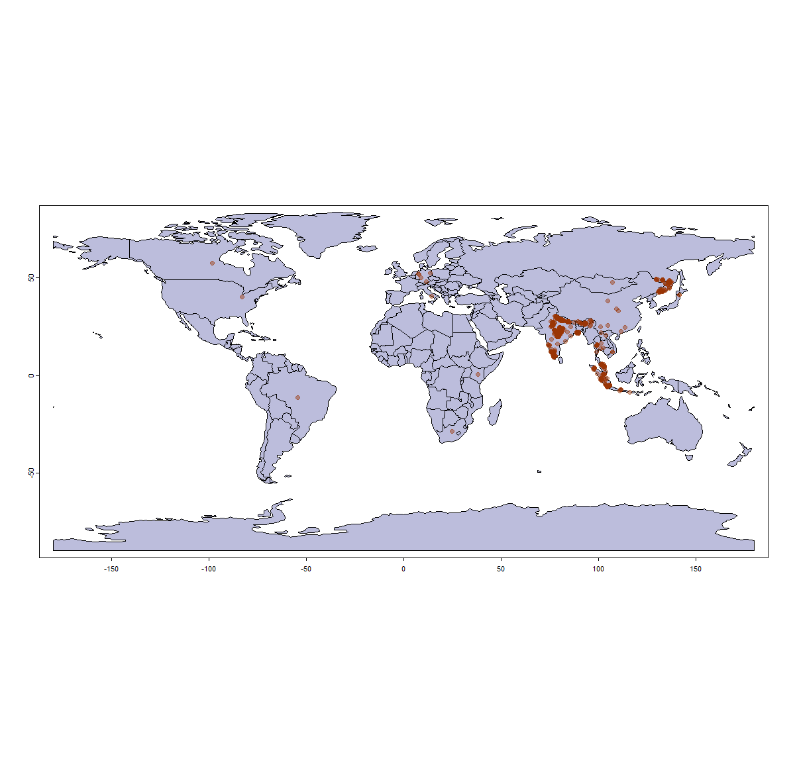
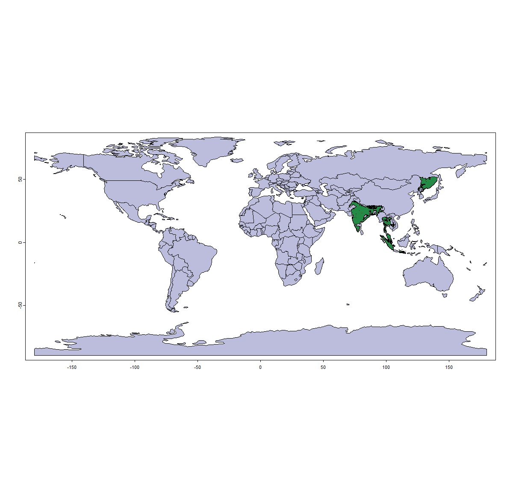
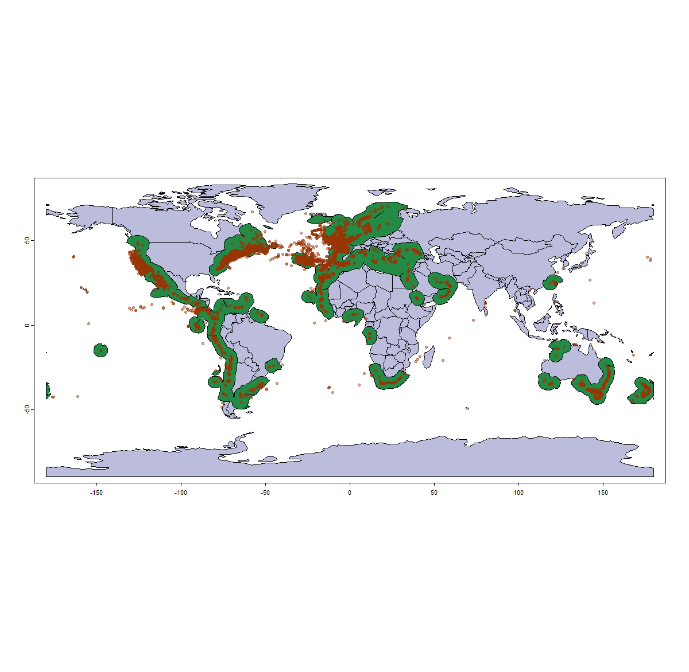
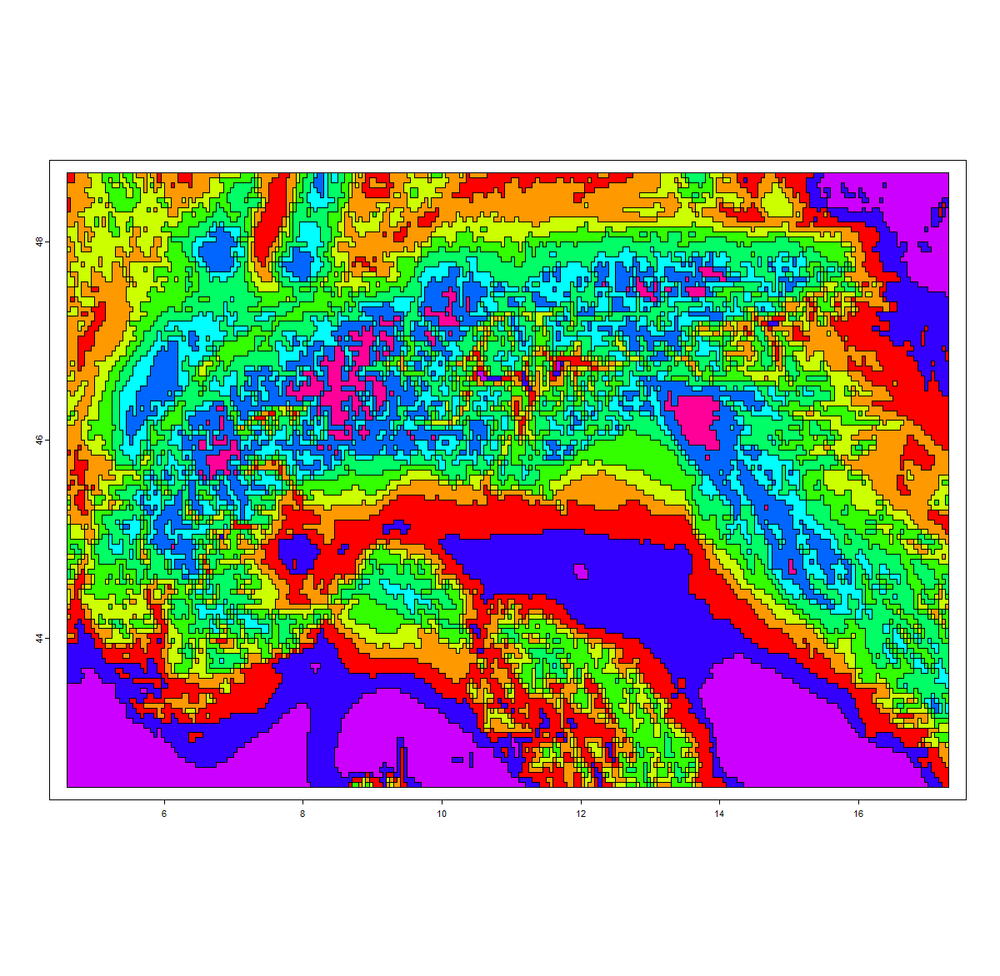
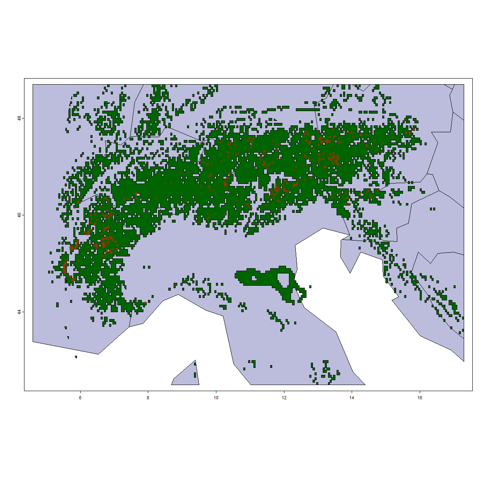
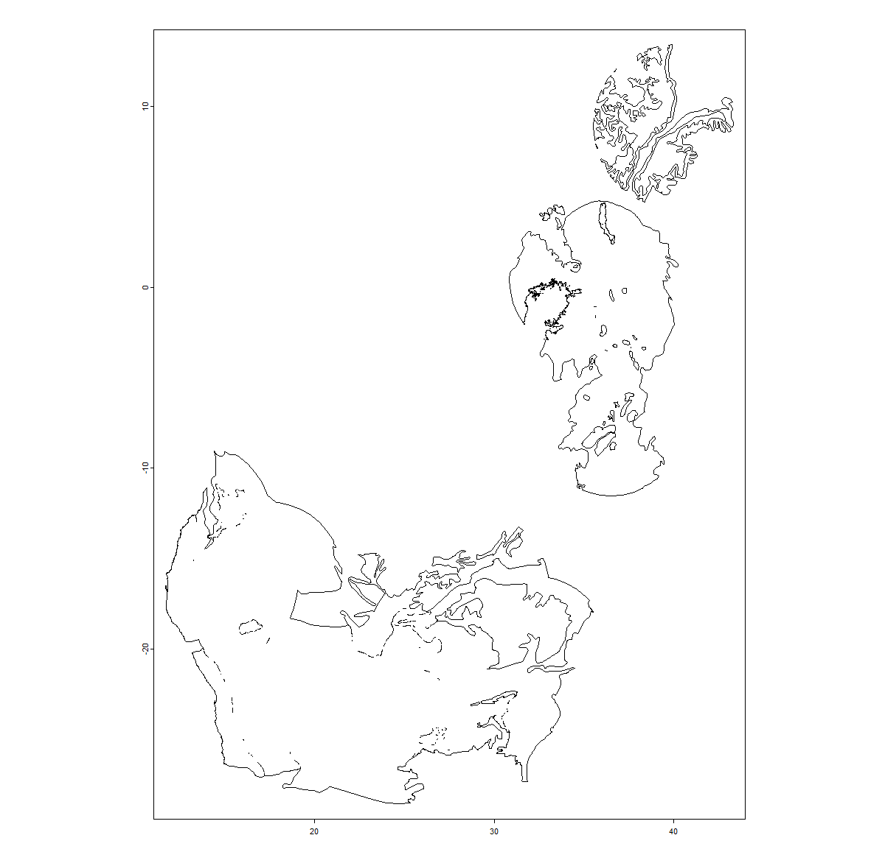

```{r setup, include = FALSE}
knitr::opts_chunk$set(
  collapse = TRUE,
  comment = "#>",
  fig.width = 7,
  fig.height = 5,
  purl = FALSE
)

library(gbif.range)
```

## Scope

This vignette gives a high-level tour of `gbif.range` and covers the two most
common single-species workflows end to end:

- a **terrestrial** example (*Panthera tigris*) using `get_status()`,
  `get_gbif()`, and `get_range()` with the packaged *eco_terra* ecoregions,
- a **marine** example (*Delphinus delphis*) demonstrating the `occ_samp`
  sampling argument for very large record volumes,
- a **local** example (*Arctostaphylos alpinus* in the European Alps) showing
  how to build a custom ecoregion layer with `make_ecoreg()`.

For deeper coverage of each topic, see the three focused vignettes:

- `vignette("gbif-retrieval-and-taxonomy", package = "gbif.range")` — taxonomy,
  filtering, thinning, and DOI generation,
- `vignette("ecoregion-constrained-range-inference", package = "gbif.range")` —
  `get_range()` in depth, packaged and custom ecoregions, evaluation,
- `vignette("large-downloaded-gbif-tables", package = "gbif.range")` — the
  disk-based batch workflow for large multi-species GBIF exports.

## Installation

```{r install, eval = FALSE}
remotes::install_github("8Ginette8/gbif.range", build_vignettes = TRUE)
library(gbif.range)
```

Install with `build_vignettes = TRUE` so that `browseVignettes("gbif.range")`
finds all workflow vignettes after installation.

## Package overview

`gbif.range` provides a complete workflow from raw GBIF records to
ecologically informed range maps. Spatial operations throughout rely on the
`terra` package (Hijmans 2022). The main functions are:

| Function | Role |
|---|---|
| `get_status()` | Inspect the GBIF backbone taxon concept, synonyms, infra-specific taxa, and IUCN status |
| `get_gbif_count()` | Estimate record volume before downloading |
| `get_gbif()` | Credential-free, synonym-aware occurrence download with 13 post-processing filters |
| `obs_filter()` | Grid-based occurrence thinning |
| `get_range()` | Ecoregion-constrained range inference |
| `read_ecoreg()` | Download and read packaged ecoregion files |
| `make_ecoreg()` | Build a custom ecoregion layer from environmental rasters |
| `make_tiles()` | Generate GBIF-ready `POLYGON()` tiles for explicit tiling workflows |
| `get_doi()` | Create a citable GBIF-derived DOI for downloaded records |
| `evaluate_range()` | Validate a range map against user-supplied distribution data |
| `cv_range()` | Cross-validate a `get_range()` output against its occurrence data |
| `split_gbif_by_species()` | Stream a large downloaded GBIF table and write one file per species |
| `species_csvs_to_ranges()` | Build one range per species from per-species occurrence files |
| `read_range_rds()` | Read a `.rds` range file saved by `species_csvs_to_ranges()` |

## Terrestrial example: *Panthera tigris*

### Inspect the taxon concept

Before downloading, `get_status()` shows which accepted name and synonyms
`get_gbif()` will use internally, and retrieves the current IUCN Red List
status from the GBIF backbone.

```{r get-status-tiger, eval = FALSE}
# Accepted name and direct synonyms only (the default)
get_status("Panthera tigris")

# Also include infra-specific taxa (subspecies, varieties) —
# these are the keys actually used by get_gbif()
get_status("Panthera tigris", level = "children")
```

`level = "all"` additionally returns alternative name representations for
manual inspection, but those extra entries are not used for occurrence
retrieval.

### Download occurrences

```{r get-gbif-tiger, eval = FALSE}
obs.pt <- get_gbif(sp_name = "Panthera tigris")
```

`get_gbif()` works without GBIF credentials. It is built on top of `rgbif`
(Chamberlain et al. 2022) and harmonizes the query to the accepted GBIF taxon
key, applies a dynamic moving-window tiling strategy when the geographic extent
contains more than 100,000 records, and runs 13 configurable post-processing
filters based on custom logic and `CoordinateCleaner` (Zizka et al. 2019).

```{r plot-tiger-occ, eval = FALSE}
countries <- rnaturalearth::ne_countries(type = "countries", returnclass = "sv")
terra::plot(countries, col = "#bcbddc")
points(obs.pt[, c("decimalLongitude", "decimalLatitude")],
       pch = 20, col = "#99340470", cex = 1.5)
```

```{r fig-tiger-occ, echo = FALSE, out.width = "100%"}

```

Note that some records of likely captive individuals remain (e.g., in Europe,
the U.S., and South Africa) — the default `CoordinateCleaner`-based filters do
not remove all zoo or botanical garden records. The `get_gbif()` help page
documents the available post-processing arguments for stricter cleaning.

### Build the range map

```{r range-tiger, eval = FALSE}
# Download and read the packaged terrestrial ecoregions (The Nature Conservancy 2009)
eco.terra <- read_ecoreg(ecoreg_name = "eco_terra", save_dir = NULL)

range.tiger <- get_range(
  occ_coord        = obs.pt,
  ecoreg           = eco.terra,
  ecoreg_name      = "ECO_NAME",
  degrees_outlier  = 5,
  clust_pts_outlier = 4
)

terra::plot(countries, col = "#bcbddc")
terra::plot(range.tiger$rangeOutput, col = "#238b45",
            add = TRUE, axes = FALSE, legend = FALSE)
```

```{r fig-tiger-range, echo = FALSE, out.width = "100%"}

```

`degrees_outlier` and `clust_pts_outlier` control how isolated clusters of
observations are handled before the ecoregion lookup. Increasing either
parameter produces a more conservative range that excludes more distant
clusters; the defaults (~550 km and ~440 km respectively) already removed the
most obvious anomalies in Europe, the U.S., and South Africa for this example.

## Marine example: *Delphinus delphis*

For species with very large GBIF footprints, `occ_samp` extracts a subsample
of *n* observations per geographic tile rather than retrieving all available
records. This trades completeness for speed and is appropriate for exploratory
analysis or very broad-extent range inference.

```{r marine-example, eval = FALSE}
# 1000 observations per tile — faster, but less spatially complete
obs.dd <- get_gbif("Delphinus delphis", occ_samp = 1000)

# level = "all" includes doubtful or provisional names for manual inspection
get_status("Delphinus delphis", level = "all")

# Build range maps at three levels of ecoregion detail
eco.marine <- read_ecoreg(ecoreg_name = "eco_marine", save_dir = NULL)

range.dd1 <- get_range(obs.dd, eco.marine, "ECOREGION")
range.dd2 <- get_range(obs.dd, eco.marine, "PROVINCE")
range.dd3 <- get_range(obs.dd, eco.marine, "REALM")

# Plot the coarsest result
terra::plot(countries, col = "#bcbddc")
terra::plot(range.dd3$rangeOutput, col = "#238b45",
            add = TRUE, axes = FALSE, legend = FALSE)
points(obs.dd[, c("decimalLongitude", "decimalLatitude")],
       pch = 20, col = "#99340470", cex = 1)
```

```{r fig-dolphin, echo = FALSE, out.width = "100%"}

```

Because only a subsample was retrieved, the resulting map closely follows the
GBIF sampling pattern. Increasing or removing `occ_samp` would produce a more
complete distributional estimate.

## Available ecoregions

The `ecoreg_list` object lists all ecoregion files that can be downloaded with
`read_ecoreg()`:

```{r ecoreg-list, eval = FALSE}
ecoreg_list
```

The packaged ecoregion layers and their available spatial levels are:

| Layer | `ecoreg_name` values |
|---|---|
| `eco_terra` — terrestrial (Olson et al. 2001; The Nature Conservancy 2009) | `"ECO_NAME"`, `"WWF_MHTNAM"`, `"WWF_REALM2"` |
| `eco_marine` — marine (Spalding et al. 2007; The Nature Conservancy 2012) | `"ECOREGION"`, `"PROVINCE"`, `"REALM"` |
| `eco_hd_marine` — high-detail marine coastlines (Spalding et al. 2007, 2012; The Nature Conservancy 2012) | `"ECOREGION"`, `"PROVINCE"`, `"REALM"` |
| `eco_fresh` — freshwater (Abell et al. 2008) | `"ECOREGION"` |

Any suitable polygon shapefile can be supplied to `get_range()` as the
`ecoreg` argument in place of the packaged layers.

## Local example: custom ecoregions with `make_ecoreg()`

For regional analyses the packaged ecoregions may be too coarse.
`make_ecoreg()` builds a custom ecoregion layer by k-means clustering of one
or more environmental rasters.

The example below first illustrates what a `make_ecoreg()` output looks like
with 10 classes over the European Alps, using two CHELSA bioclimatic layers
(Karger et al. 2017) — mean annual temperature (bio1) and annual precipitation
(bio12) at 5 × 5 km resolution. The `make_ecoreg()` function applies k-means
clustering to derive ecologically coherent units from environmental rasters
(Hagen et al. 2019):

```{r make-ecoreg-plot, eval = FALSE}
bio <- terra::rast(paste0(system.file(package = "gbif.range"), "/extdata/rst.tif"))
eco.eg <- make_ecoreg(env = bio, nclass = 10)
terra::plot(eco.eg, col = rainbow(10))
```

```{r fig-ecoreg, echo = FALSE, out.width = "100%"}

```

For a real regional analysis, more classes are appropriate. The full workflow
with 200 classes and *Arctostaphylos alpinus*:

```{r custom-ecoreg, eval = FALSE}
# Two CHELSA bioclimatic layers for the European Alps at 5 x 5 km resolution
bio <- terra::rast(paste0(system.file(package = "gbif.range"), "/extdata/rst.tif"))

# 200 ecoregion classes
my.eco <- make_ecoreg(env = bio, nclass = 200)

# Download Arctostaphylos alpinus within the Alps bounding box
shp.lonlat <- terra::vect(
  paste0(system.file(package = "gbif.range"), "/extdata/shp_lonlat.shp")
)
obs.arcto <- get_gbif(
  sp_name = "Arctostaphylos alpinus",
  geo     = shp.lonlat,
  grain   = 1            # 1 km precision — appropriate for a local extent
)

# Build the range (always use 'EcoRegion' as ecoreg_name for make_ecoreg() output)
range.arcto <- get_range(
  occ_coord         = obs.arcto,
  ecoreg            = my.eco,
  ecoreg_name       = "EcoRegion",
  degrees_outlier   = 5,
  clust_pts_outlier = 4,
  res               = 0.05        # 5 x 5 km output resolution
)

# Plot
alps.shp <- terra::crop(countries, terra::ext(bio))
r.arcto  <- terra::mask(range.arcto$rangeOutput, alps.shp)
terra::plot(alps.shp, col = "#bcbddc")
terra::plot(r.arcto, add = TRUE, col = "darkgreen", axes = FALSE, legend = FALSE)
points(obs.arcto[, c("decimalLongitude", "decimalLatitude")],
       pch = 20, col = "#99340470", cex = 1)
```

```{r fig-arcto, echo = FALSE, out.width = "100%"}

```

Two design choices matter here. First, `grain = 1` keeps only records with
coordinate uncertainty ≤ 1 km; at larger scales the default 100 km grain is
appropriate, but for a small alpine extent it would retain too many imprecise
records. Second, the `res` argument sets the output raster resolution, which
can be as fine as the input environmental layers allow.

## Large downloaded GBIF tables

For multi-species analyses where GBIF data have already been downloaded as a
single large file, `gbif.range` provides a disk-based batch workflow that
avoids loading the full table into memory:

```{r disk-workflow, eval = FALSE}
gbif_file <- system.file("extdata", "occ_example_4sps.csv", package = "gbif.range")

split_dir <- file.path(tempdir(), "gbif_split")
range_dir <- file.path(tempdir(), "gbif_ranges")

# 1. Split the large table into one file per GBIF taxon key
split_summary <- split_gbif_by_species(
  input_file = gbif_file,
  outdir     = split_dir,
  chunk_size = 100,
  sep_in     = "\t",
  sep_out    = "\t",
  overwrite  = TRUE,
  verbose    = FALSE
)

# 2. Build one range per species from the per-species files
range_summary <- species_csvs_to_ranges(
  species_dir   = split_dir,
  ecoreg        = "eco_terra",
  ecoreg_name   = "ECO_NAME",
  outdir        = range_dir,
  range_save_as = "rds",
  overwrite     = TRUE,
  verbose       = FALSE
)

# 3. Read one saved range back from disk
rg <- read_range_rds(range_summary$range_file[1])
terra::plot(rg$rangeOutput)
```

```{r fig-disk, echo = FALSE, out.width = "100%"}

```

This workflow is described in full in
`vignette("large-downloaded-gbif-tables", package = "gbif.range")`.

## Next steps

The three focused vignettes cover each part of the workflow in depth. Part 1
(*Ecoregion-Based Range Inference*) documents `get_range()`, the packaged and
custom ecoregion options, and the evaluation functions `cv_range()` and
`evaluate_range()`. Part 2 (*GBIF Retrieval, Taxonomy, and Filtering*) covers
`get_status()`, `get_gbif_count()`, `get_gbif()`, `obs_filter()`,
`make_tiles()`, and `get_doi()`. Part 3 (*Large Downloaded GBIF Tables*)
describes the disk-based batch workflow built around `split_gbif_by_species()`,
`species_csvs_to_ranges()`, and `read_range_rds()`.

## References

Abell, R., Thieme, M. L., Revenga, C., Bryer, M., Kottelat, M., Bogutskaya, N., … Petry, P. (2008). Freshwater ecoregions of the world: a new map of biogeographic units for freshwater biodiversity conservation. *BioScience*, 58(5), 403–414. https://doi.org/10.1641/B580507

Chamberlain, S., Oldoni, D., & Waller, J. (2022). rgbif: interface to the global biodiversity information facility API. https://doi.org/10.5281/zenodo.6023735


Hagen, O., Vaterlaus, L., Albouy, C., Brown, A., Leugger, F., Onstein, R. E., Novaes de Santana, C., Scotese, C. R., & Pellissier, L. (2019). Mountain building, climate cooling and the richness of cold-adapted plants in the Northern Hemisphere. *Journal of Biogeography*, 46(8), 1792–1807. https://doi.org/10.1111/jbi.13653

Hijmans, R. J. (2022). terra: Spatial Data Analysis. R package version 1.6-7. https://cran.r-project.org/web/packages/terra/index.html

Karger, D. N., Conrad, O., Böhner, J., Kawohl, T., Kreft, H., Soria-Auza, R. W., Zimmermann, N. E., Linder, H. P., & Kessler, M. (2017). Climatologies at high resolution for the earth's land surface areas. *Scientific Data*, 4, 170122. https://doi.org/10.1038/sdata.2017.122

Olson, D. M., Dinerstein, E., Wikramanayake, E. D., Burgess, N. D., Powell, G. V. N., Underwood, E. C., … Kassem, K. R. (2001). Terrestrial ecoregions of the world: a new map of life on Earth. *BioScience*, 51(11), 933–938. https://doi.org/10.1641/0006-3568(2001)051[0933:TEOTWA]2.0.CO;2

Spalding, M. D., Fox, H. E., Allen, G. R., Davidson, N., Ferdaña, Z. A., Finlayson, M., … Robertson, J. (2007). Marine ecoregions of the world: a bioregionalization of coastal and shelf areas. *BioScience*, 57(7), 573–583. https://doi.org/10.1641/B570707

Spalding, M. D., Agostini, V. N., Rice, J., & Grant, S. M. (2012). Pelagic provinces of the world: a biogeographic classification of the world's surface pelagic waters. *Ocean & Coastal Management*, 60, 19–30. https://doi.org/10.1016/j.ocecoaman.2011.12.016

The Nature Conservancy (2009). Global Ecoregions, Major Habitat Types, Biogeographical Realms and The Nature Conservancy Terrestrial Assessment Units. Cambridge (UK): The Nature Conservancy. https://geospatial.tnc.org/datasets/b1636d640ede4d6ca8f5e369f2dc368b/about

The Nature Conservancy (2012). Marine Ecoregions and Pelagic Provinces of the World. Cambridge (UK): The Nature Conservancy. http://data.unep-wcmc.org/datasets/38

Zizka, A., Silvestro, D., Andermann, T., Azevedo, J., Duarte Ritter, C., Edler, D., … Antonelli, A. (2019). CoordinateCleaner: Standardized cleaning of occurrence records from biological collection databases. *Methods in Ecology and Evolution*, 10(5), 744–751. https://doi.org/10.1111/2041-210X.13152
